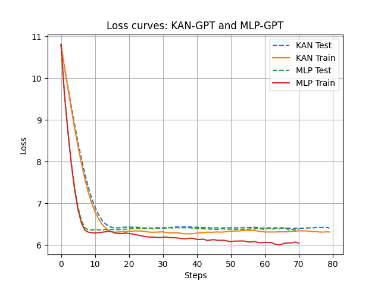
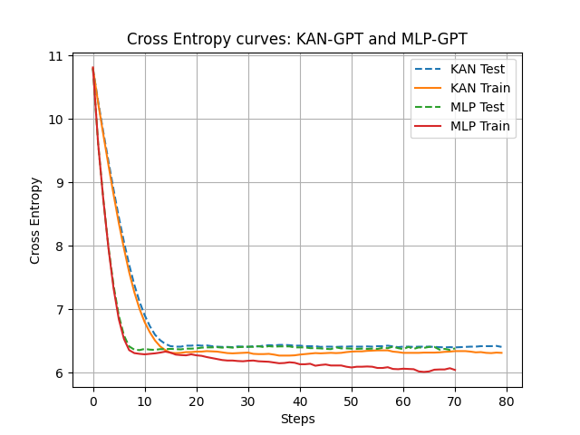
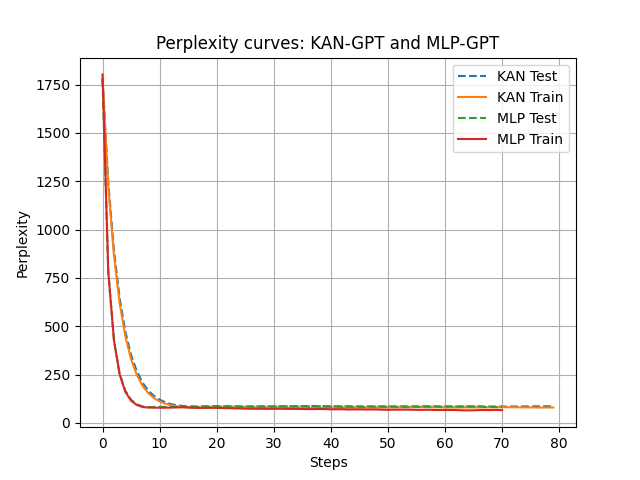

# Results

We train and compare KAN-GPT with an equivalent MLP-GPT model on the Tiny Shakespeare dataset. We observe that the KAN-GPT performs slightly better than the MLP-GPT. We are looking into further experiments to dive deeper. The results are shown below:

## Metrics

| Metrics |   |   |
|---------|---------|---------|
|  |  |  |
